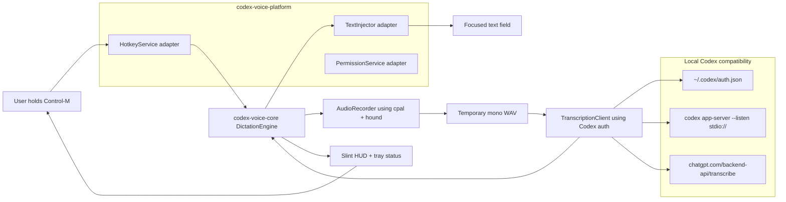
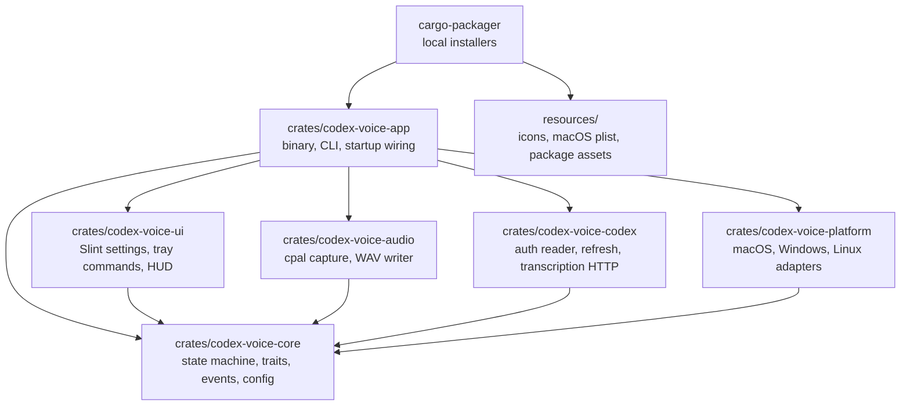
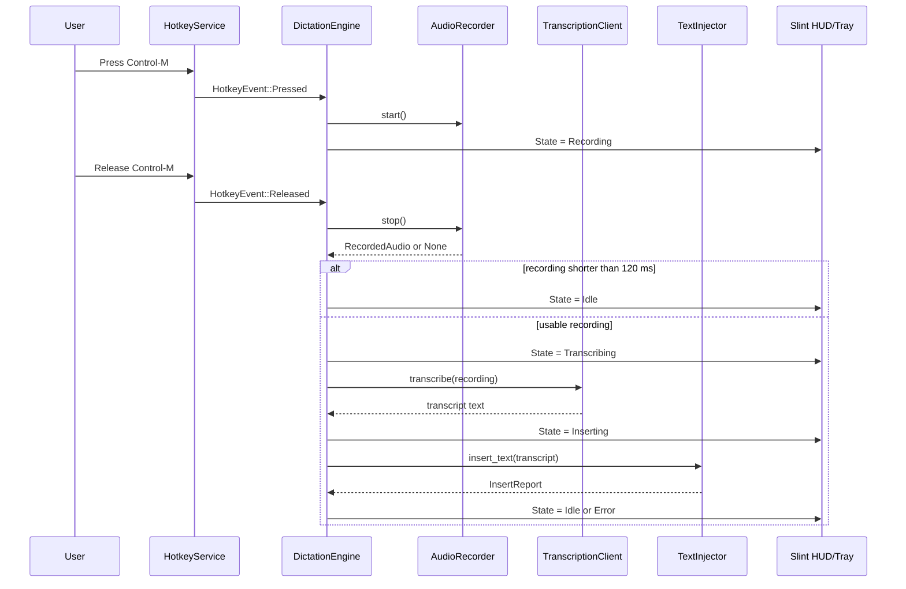
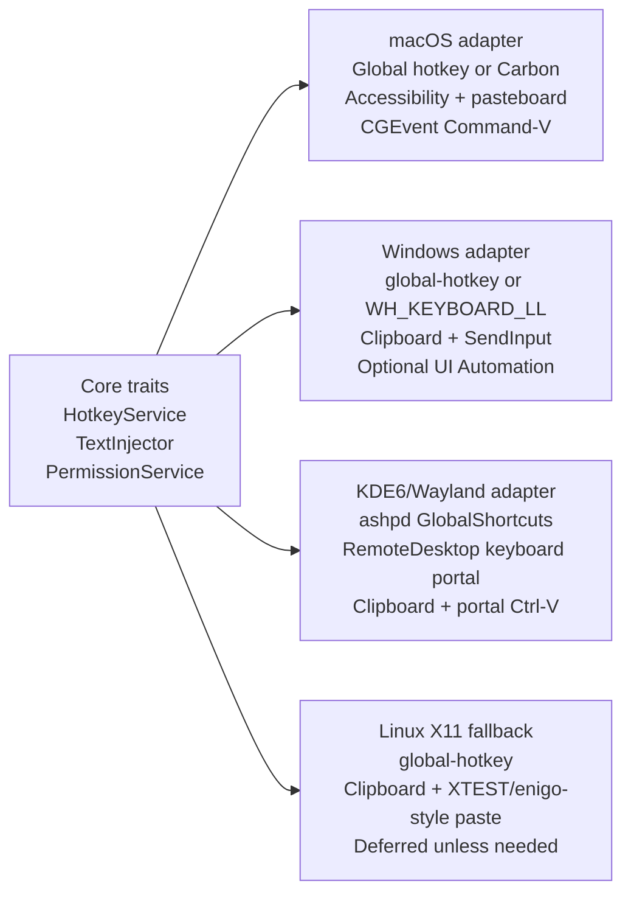
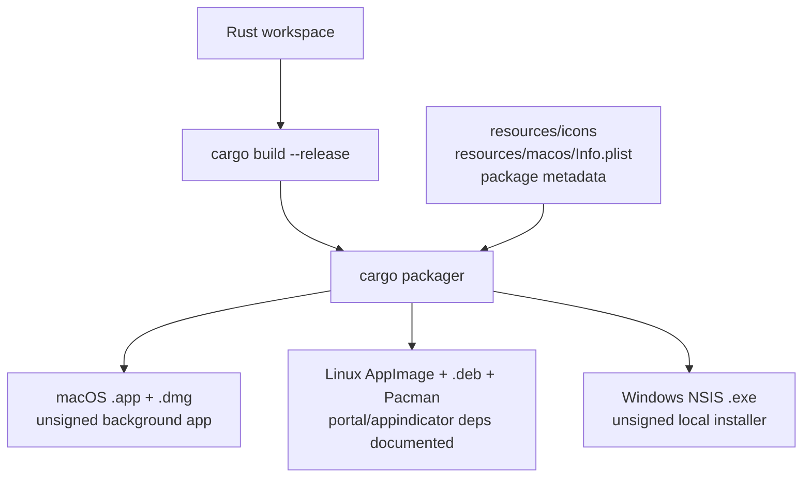

# Reimplement Codex Voice as a Rust-Native Cross-Platform Desktop App

This ExecPlan is a living document. The sections `Progress`, `Surprises & Discoveries`, `Decision Log`, and `Outcomes & Retrospective` must be kept up to date as work proceeds.

This plan follows `/Users/rebecca/.agents/PLANS.md`.

## Purpose / Big Picture

Reimplement Codex Voice as a Rust-native desktop utility for macOS, KDE6/Wayland Linux, and Windows 11 without Electron, Tauri, or any webview. After this work, a user can install Codex Voice locally, hold `Control-M`, speak, release the hotkey, and have the transcript inserted into the currently focused app.

The existing Swift app remains a behavioral reference only. The new implementation uses Rust crates for the core app, Slint for small native UI surfaces, platform-specific adapters for hotkeys/text insertion/permissions, and `cargo-packager` for unsigned local installers.

## Progress

- [x] (2026-04-24) Confirmed current app behavior: macOS Swift menu-bar app, hold-to-dictate, Codex auth reuse, private ChatGPT transcription endpoint, Accessibility/paste fallback.
- [x] (2026-04-24) Chose Slint, Codex auth reuse, and unsigned local installers as v1 defaults.
- [x] (2026-04-24) Researched platform constraints and crate choices for audio, tray, hotkeys, Linux Wayland portals, Windows input, macOS permissions, and packaging.
- [x] (2026-04-24) Added architecture, crate, runtime, platform, and packaging diagrams to make the plan easier to execute from a cold start.
- [x] (2026-04-24) Created the Rust workspace and scaffolded the planned crates under `crates/`.
- [x] (2026-04-24) Implemented the core dictation state machine and CPAL-backed mono WAV capture.
- [x] (2026-04-24) Implemented Codex auth file reading, app-server refresh, and private transcription HTTP compatibility.
- [ ] Prove Linux KDE6/Wayland global shortcut and paste insertion.
- [ ] Implement macOS and Windows adapters.
- [ ] Add Slint tray/settings/HUD UI.
- [ ] Add packaging with `cargo-packager`.
- [ ] Validate end-to-end on macOS, Linux KDE6/Wayland, and Windows 11.

## Surprises & Discoveries

- Observation: The Rust `global-hotkey` crate supports Windows, macOS, and Linux X11 only, not Wayland.
  Evidence: `global-hotkey` docs list Linux support as X11 only; XDG GlobalShortcuts exposes portal activation/deactivation events.

- Observation: Linux Wayland text insertion must be permission-mediated. The preferred path is clipboard plus RemoteDesktop portal keyboard events, with explicit diagnostics when portal permission is denied or unavailable.
  Evidence: XDG RemoteDesktop portal exposes keyboard device selection and `notify_keyboard_keycode` / `notify_keyboard_keysym`; `ashpd` exposes these methods and `connect_to_eis`.

- Observation: On this Linux KDE/Wayland host, `org.freedesktop.portal.GlobalShortcuts` and `org.freedesktop.portal.RemoteDesktop` are present on the user bus.
  Evidence: `busctl --user introspect org.freedesktop.portal.Desktop /org/freedesktop/portal/desktop org.freedesktop.portal.GlobalShortcuts` reports `version` 1 and activation/deactivation signals; the RemoteDesktop interface reports `version` 2 and `NotifyKeyboardKeysym`.

- Observation: The first Linux implementation has a runnable engine, audio, auth, transcription, and portal diagnostics, but the true GlobalShortcuts binding and RemoteDesktop keyboard session are not complete yet. Hotkey diagnostics use terminal Enter simulation, and paste diagnostics require `wtype` or `ydotool`.
  Evidence: `cargo check --workspace` and `cargo test --workspace` pass; `command -v wtype` and `command -v ydotool` returned absent on this host.

- Observation: `cargo-packager` is the right installer crate for this plan because it supports macOS `.app`/`.dmg`, Linux `.deb`/AppImage/Pacman, and Windows NSIS/MSI from Rust packaging metadata.
  Evidence: `cargo-packager` docs list those formats and `package.metadata.packager` configuration.

## Decision Log

- Decision: Build a greenfield Rust workspace instead of porting Swift code.
  Rationale: The current app's core behavior is small, while platform integration differs sharply across macOS, Wayland Linux, and Windows. A Rust workspace with adapter crates makes those differences explicit.
  Date/Author: 2026-04-24 / Codex

- Decision: Use Slint for settings/HUD UI.
  Rationale: Slint is Rust-native, desktop-oriented, and runs on Windows, macOS, and Linux without a webview. The UI need is small and polished, not a complex web app.
  Date/Author: 2026-04-24 / Bex + Codex

- Decision: Reuse Codex auth for v1.
  Rationale: This preserves the current product behavior: the app works from the user's existing local Codex sign-in and `~/.codex/auth.json`. The plan must document that this is private-backend-compatible and may break if Codex changes its internal transcription flow.
  Date/Author: 2026-04-24 / Bex + Codex

- Decision: Use unsigned local installer artifacts first.
  Rationale: `cargo-packager` can produce useful local artifacts before signing/notarization complexity is added. Signed production release automation is deferred.
  Date/Author: 2026-04-24 / Bex + Codex

- Decision: Make Linux KDE6/Wayland the first platform proof.
  Rationale: Wayland global shortcuts and input injection are the highest-risk parts. If the Linux portal path works, macOS and Windows are mostly adapter work.
  Date/Author: 2026-04-24 / Codex

- Decision: Embed Mermaid diagrams in the ExecPlan.
  Rationale: The implementation spans multiple crates, platform adapters, runtime event flow, and installer outputs. Diagrams reduce ambiguity for future agents without replacing the prose requirements.
  Date/Author: 2026-04-24 / Codex

## Outcomes & Retrospective

Initial Linux implementation is in place. The workspace builds, the core state machine has unit coverage for short-recording discard behavior, CPAL writes temporary mono WAV files, Codex auth/transcription compatibility is isolated in its own crate, and the Linux app exposes diagnostic commands.

Remaining Linux risk is concentrated in the portal-native input path: GlobalShortcuts session binding and RemoteDesktop keyboard event emission still need to replace the current terminal hotkey simulation and `wtype`/`ydotool` paste fallback. macOS, Windows, Slint UI, and packaging remain deferred.

## Context and Orientation

The current repository root is `/Users/rebecca/projects/codex-voice`. The existing implementation is a Swift macOS app under `/Users/rebecca/projects/codex-voice/CodexVoice`.

Important behavioral reference files:

- `/Users/rebecca/projects/codex-voice/CodexVoice/DictationController.swift` defines the state flow: idle, recording, transcribing, inserting, error.
- `/Users/rebecca/projects/codex-voice/CodexVoice/AudioCaptureService.swift` records temporary WAV files.
- `/Users/rebecca/projects/codex-voice/CodexVoice/CodexAuthService.swift` reads `~/.codex/auth.json` and refreshes auth by running `codex app-server --listen stdio://`.
- `/Users/rebecca/projects/codex-voice/CodexVoice/CodexTranscriptionService.swift` posts multipart WAV data to `https://chatgpt.com/backend-api/transcribe`.
- `/Users/rebecca/projects/codex-voice/CodexVoice/TextInsertionService.swift` inserts text through macOS Accessibility first, then clipboard paste fallback.
- `/Users/rebecca/projects/codex-voice/CodexVoice/HotkeyMonitor.swift` uses macOS Carbon hotkey events for `Control-M` press/release.
- `/Users/rebecca/projects/codex-voice/CodexVoice/DictationHUDController.swift` shows a small floating HUD while recording/transcribing/inserting.

Terms used in this plan:

- A daemon is a background process. Here it means the Codex Voice app runs without a normal document window and listens for the global hotkey.
- An adapter is platform-specific Rust code hidden behind a common trait. For example, Windows and Linux text insertion use different OS APIs but both implement `TextInjector`.
- A portal is a Linux desktop permission API exposed over D-Bus. On Wayland, apps cannot freely monitor global shortcuts or inject keyboard input; the desktop grants those abilities through portals.
- EIS/libei is the newer Linux input-emulation path used by some compositors and portals. It may become preferable later, but v1 should first use XDG portal keyboard notifications.

## Architecture Diagrams

The Rust app is organized around a platform-neutral dictation engine. The engine knows how to move between recording, transcription, and insertion states, but it does not know how any operating system captures audio, registers shortcuts, requests permissions, shows tray UI, or pastes text. Those behaviors live in platform adapters.

The workspace is split so that platform-specific code can be tested and replaced without contaminating the state machine. The app binary is the only crate that wires every subsystem together.

The runtime flow intentionally mirrors the current Swift app. `Control-M` press starts capture, release stops capture, transcription runs once per recording, and insertion happens only for non-empty transcripts.

The platform adapters all implement the same traits, but the implementation mechanisms differ. Linux KDE6/Wayland is the first proof because it depends on user-mediated portals rather than direct global input access.

Packaging is also part of the architecture. The same app binary should feed local unsigned artifacts for each platform, with signing and notarization deferred until a later plan.

## Research Notes Embedded in This Plan

Use these facts as implementation constraints, not as vague background.

Slint: Slint supports desktop apps on Windows, macOS, and common Linux distributions. On Windows, release builds should set `#![cfg_attr(not(debug_assertions), windows_subsystem = "windows")]` so the app does not open a console. Source: [Slint desktop docs](https://docs.slint.dev/latest/docs/slint/guide/platforms/desktop/).

System tray: Use `tray-icon` for v1 tray integration. It supports Windows, macOS, and Linux GTK. On Linux it depends on GTK plus `libappindicator` or `libayatana-appindicator`; package those dependencies/document them. Source: [tray-icon docs](https://docs.rs/tray-icon/latest/tray_icon/).

Audio capture: Use `cpal` for cross-platform microphone input. CPAL gives access to default input devices and input streams across platform backends including CoreAudio, ALSA/PipeWire-adjacent Linux paths, and WASAPI. Use `hound` or another WAV writer to write 16-bit mono WAV. Source: [cpal docs](https://docs.rs/cpal/latest/cpal/).

Hotkeys: Use `global-hotkey` for macOS, Windows, and Linux X11 only. Do not use it as the KDE6/Wayland path. It supports pressed/released event state but documents Linux as X11 only. Source: [global-hotkey docs](https://docs.rs/global-hotkey).

Linux KDE6/Wayland shortcuts: Use the XDG GlobalShortcuts portal via `ashpd`. Bind `Control-M` as the default shortcut and listen for activated/deactivated events to map hold-to-dictate press/release. Sources: [XDG GlobalShortcuts portal](https://flatpak.github.io/xdg-desktop-portal/docs/doc-org.freedesktop.portal.GlobalShortcuts.html), [ashpd GlobalShortcuts](https://bilelmoussaoui.github.io/ashpd/ashpd/desktop/global_shortcuts/struct.GlobalShortcuts.html).

Linux KDE6/Wayland insertion: Use clipboard set plus RemoteDesktop portal keyboard events to send paste. Request keyboard device access, start the portal session, then emit Ctrl down, V down/up, Ctrl up through keycode or keysym methods. Sources: [XDG RemoteDesktop portal](https://flatpak.github.io/xdg-desktop-portal/docs/doc-org.freedesktop.portal.RemoteDesktop.html), [ashpd RemoteDesktop](https://docs.rs/ashpd/latest/ashpd/desktop/remote_desktop/struct.RemoteDesktop.html).

Windows shortcuts and insertion: For hotkeys, prefer `RegisterHotKey` if it can provide sufficient semantics; otherwise use a low-level keyboard hook only for press/release fidelity. For insertion, prefer clipboard plus `SendInput(Ctrl+V)`. Do not use `PostMessage` to fake keyboard input. `SendInput` is blocked by UIPI when targeting higher-integrity apps, and this may not be distinguishable from other failures. Sources: [RegisterHotKey](https://learn.microsoft.com/en-us/windows/win32/api/winuser/nf-winuser-registerhotkey), [SendInput](https://learn.microsoft.com/en-us/windows/win32/api/winuser/nf-winuser-sendinput), [Old New Thing on PostMessage](https://devblogs.microsoft.com/oldnewthing/20250319-00/?p=110979).

Windows UI Automation fallback: UI Automation `ValuePattern.SetValue` can set values for controls that support it, but multi-line/edit/document controls often require simulated text input instead. Treat it as an optional later fallback, not the primary insertion method. Source: [ValuePattern.SetValue](https://learn.microsoft.com/en-us/dotnet/api/system.windows.automation.valuepattern.setvalue).

macOS permissions and insertion: The app needs microphone usage text in `Info.plist`, Accessibility trust checks for global key monitoring/insertion, and CGEvent-style paste fallback. Apple deprecates older `CGPostKeyboardEvent` and recommends `CGEventCreateKeyboardEvent` plus posting the event. Source: [Apple CGPostKeyboardEvent deprecation note](https://developer.apple.com/documentation/coregraphics/cgpostkeyboardevent%28_%3A_%3A_%3A%29?language=objc).

Packaging: Use `cargo-packager` from the Rust workspace. It supports macOS `.app` and `.dmg`, Linux `.deb`, AppImage, and Pacman packages, and Windows NSIS `.exe` plus WiX `.msi`. It reads `Packager.toml`, `packager.json`, or `[package.metadata.packager]` in `Cargo.toml`. Sources: [cargo-packager docs](https://docs.rs/cargo-packager), [cargo-packager config](https://docs.rs/cargo-packager/latest/cargo_packager/config/struct.Config.html).

macOS packaging: `cargo-packager` supports `macos.background_app`, `info_plist_path`, and `entitlements`. Set `background_app = true` so the app behaves like a menu-bar utility. Include `NSMicrophoneUsageDescription` in the packaged plist. Source: [cargo-packager MacOsConfig](https://docs.rs/cargo-packager/latest/cargo_packager/config/struct.MacOsConfig.html).

OpenAI/Codex transcription: v1 intentionally reuses the current private Codex flow. The implementation must isolate this behind a `TranscriptionClient` trait so a later official OpenAI API backend can be added without rewriting capture/UI/platform code. Official transcription API models such as `gpt-4o-transcribe` and `gpt-4o-mini-transcribe` exist, but are not the selected v1 auth path. Source for official fallback context: [OpenAI Audio transcription API](https://platform.openai.com/docs/api-reference/audio/createTranscription).

## Interfaces and Dependencies

Create a Rust workspace at `/Users/rebecca/projects/codex-voice/Cargo.toml` with these crates:

- `crates/codex-voice-core`: state machine, event types, config, error types, and traits.
- `crates/codex-voice-audio`: CPAL microphone capture and WAV writer.
- `crates/codex-voice-codex`: Codex auth file reader, app-server refresh client, and transcription HTTP client.
- `crates/codex-voice-platform`: platform adapter traits plus `macos`, `windows`, `linux_wayland`, and `linux_x11` implementations behind `cfg`.
- `crates/codex-voice-ui`: Slint UI definitions and UI controller.
- `crates/codex-voice-app`: final binary that wires all crates together.

Use these dependencies unless implementation proves one cannot meet the interface:

- `tokio` for async orchestration.
- `tracing` and `tracing-subscriber` for logs.
- `serde`, `serde_json`, and `toml` for config/auth parsing.
- `thiserror` and `anyhow` for error handling at library/app boundaries.
- `reqwest` with multipart support for transcription HTTP.
- `cpal` for audio capture.
- `hound` for WAV writing.
- `slint` and `slint-build` for UI.
- `tray-icon` for system tray.
- `arboard` for clipboard where it works.
- `ashpd` with global shortcuts and remote desktop features for Linux Wayland portals.
- `global-hotkey` for macOS, Windows, and Linux X11 hotkey fallback.
- `windows` crate for Windows `SendInput`, clipboard fallback if needed, hotkey/hook APIs, and optional UI Automation.
- `objc2`, `objc2-app-kit`, `objc2-foundation`, `objc2-core-graphics`, and `objc2-application-services` for macOS APIs if `global-hotkey` and `tray-icon` do not cover a required function.
- `dirs` for locating config/cache/log directories.
- `clap` for diagnostic subcommands.

Define these core traits in `crates/codex-voice-core/src/platform.rs`:

    pub trait HotkeyService: Send + Sync {
        fn start(&self, events: tokio::sync::mpsc::Sender<HotkeyEvent>) -> PlatformResult<()>;
    }

    pub enum HotkeyEvent {
        Pressed,
        Released,
    }

    pub trait TextInjector: Send + Sync {
        async fn insert_text(&self, text: &str) -> PlatformResult<InsertReport>;
    }

    pub struct InsertReport {
        pub method: InsertMethod,
        pub restored_clipboard: bool,
    }

    pub enum InsertMethod {
        Accessibility,
        ClipboardPaste,
        PortalPaste,
        SendInputPaste,
        UiAutomationValuePattern,
    }

    pub trait PermissionService: Send + Sync {
        async fn check(&self) -> PlatformResult<Vec<PermissionStatus>>;
        async fn request_or_open_settings(&self, permission: PermissionKind) -> PlatformResult<()>;
    }

    pub enum PermissionKind {
        Microphone,
        Accessibility,
        GlobalShortcut,
        RemoteDesktopKeyboard,
    }

Define audio capture in `crates/codex-voice-core/src/audio.rs`:

    pub trait AudioRecorder: Send + Sync {
        async fn start(&self) -> AudioResult<()>;
        async fn stop(&self) -> AudioResult<Option<RecordedAudio>>;
        async fn cancel(&self) -> AudioResult<()>;
    }

    pub struct RecordedAudio {
        pub path: std::path::PathBuf,
        pub content_type: String,
        pub filename: String,
        pub duration: std::time::Duration,
    }

Define transcription in `crates/codex-voice-core/src/transcription.rs`:

    pub trait TranscriptionClient: Send + Sync {
        async fn transcribe(&self, recording: &RecordedAudio) -> TranscriptionResult<String>;
    }

Implement the state machine as `DictationEngine` with states `Idle`, `Recording`, `Transcribing`, `Inserting`, and `Error`. It receives `HotkeyEvent`, emits `AppEvent`, and enforces the same behavior as the Swift reference: ignore presses while busy, discard recordings shorter than 120 ms, delete temp recordings after transcription attempt, and return to idle after successful insertion.

## Plan of Work

Milestone 1 creates the Rust workspace without deleting the Swift app. Add `Cargo.toml`, crate directories, a basic `cargo check` target, and a `codex-voice --version` command. The Swift app remains untouched except for documentation noting it is the reference implementation.

Milestone 2 implements the core state machine and audio capture. Use `cpal` to capture from the default input device into a temporary WAV file. Normalize to mono 16-bit PCM WAV for compatibility with the current Codex backend. Add unit tests for state transitions and short-recording discard behavior. Add a diagnostic command:

    cargo run -p codex-voice-app --bin codex-voice -- doctor audio

It should record a 2-second sample to a temp file, print the path, duration, sample rate, and byte size, then delete it unless `--keep` is passed.

Milestone 3 implements Codex auth and transcription compatibility. Read `~/.codex/auth.json` with the current `tokens.access_token` and `tokens.account_id` shape. Resolve `codex` in this order: `CODEX_CLI_PATH`, `PATH`, `/Applications/Codex.app/Contents/Resources/codex` on macOS, and plain `codex` on Linux/Windows. Refresh auth by spawning `codex app-server --listen stdio://`, sending JSON lines for `initialize` and `account/read` with `refreshToken: true`, and requiring an `id:2` result line. Post multipart form data to `https://chatgpt.com/backend-api/transcribe` with headers equivalent to the Swift app: `Authorization`, `ChatGPT-Account-Id`, `originator: Codex Desktop`, `User-Agent`, `Content-Type`, and `Accept`. Add `doctor codex-auth` and `doctor transcribe --file <wav>` commands.

Milestone 4 implements Linux KDE6/Wayland proof before polishing UI. Add `linux_wayland` adapters using `ashpd`. The hotkey adapter creates a GlobalShortcuts session, binds `Control-M`, and emits `Pressed`/`Released` from activation/deactivation. The text adapter sets the clipboard text, requests a RemoteDesktop keyboard session, starts it, waits for user permission, and sends Ctrl+V key events. Add diagnostics:

    cargo run -p codex-voice-app --bin codex-voice -- doctor linux-portals
    cargo run -p codex-voice-app --bin codex-voice -- doctor paste --text "codex voice portal paste test"

On KDE6/Wayland, the first command must report whether GlobalShortcuts and RemoteDesktop are available and their portal versions. The second command must paste the text into the focused field or print a precise denial/unavailable message.

Milestone 5 implements Windows 11 adapters. Use `global-hotkey` first for `Control-M` if it emits reliable press/release; if testing proves it only emits press or lacks release fidelity, replace the Windows hotkey path with a `WH_KEYBOARD_LL` low-level hook that tracks left/right Control plus M and emits a single press and release per hold. Use clipboard plus `SendInput(Ctrl+V)` for insertion, waiting for Control to be released before paste so the dictation hotkey does not contaminate the paste chord. Add diagnostics:

    cargo run -p codex-voice-app --bin codex-voice -- doctor hotkey
    cargo run -p codex-voice-app --bin codex-voice -- doctor paste --text "codex voice windows paste test"

Document that insertion into elevated apps may fail from a non-elevated Codex Voice process because of UIPI.

Milestone 6 implements macOS adapters. Use `global-hotkey` or direct Carbon only if needed to preserve press/release semantics. Use AppKit/ApplicationServices bindings for Accessibility checks and settings links. Implement insertion as Accessibility selected-text replacement first, then clipboard plus CGEvent Command-V fallback, preserving and restoring the previous pasteboard. Include `NSMicrophoneUsageDescription` and background-app configuration in the packaged app. Add diagnostics equivalent to Windows.

Milestone 7 adds Slint UI, tray, and HUD. The app should start as a tray/background utility. The tray menu includes status, "Start Test Recording", "Open Settings", "Open Logs", "Run Diagnostics", and "Quit". The settings window lets the user configure the hotkey string, view permission status, choose transcription timeout, and enable debug logs. The HUD is a small always-on-top status surface with four states: Listening, Transcribing, Inserting, and Error. Do not add account management in v1; the app relies on Codex sign-in.

Milestone 8 adds packaging with `cargo-packager`. Add `[package.metadata.packager]` to the app crate or a root `Packager.toml`. Use product name `Codex Voice`, identifier `dev.codexvoice.app`, category `Productivity`, and icon resources under `resources/icons`. Configure formats:

- macOS: `.app` and `.dmg`, background app, custom `Info.plist`, unsigned.
- Linux: AppImage, `.deb`, and Pacman package, with dependencies documented for GTK/appindicator/portal packages.
- Windows: NSIS `.exe`; WiX `.msi` can be added if local WiX tooling exists.

Add package commands:

    cargo install cargo-packager --locked
    cargo packager --release --format app,dmg
    cargo packager --release --format appimage,deb,pacman
    cargo packager --release --format nsis

Milestone 9 validates end-to-end behavior on all three platforms and updates the README. Each platform must demonstrate: app starts, tray appears, permissions are detectable, hotkey press starts recording, hotkey release transcribes, text inserts into a focused editor, short recordings are ignored, auth refresh works or fails with a clear message, and logs identify the insertion method used.

## Concrete Steps

From `/Users/rebecca/projects/codex-voice`, create the workspace:

    cargo new crates/codex-voice-core --lib
    cargo new crates/codex-voice-audio --lib
    cargo new crates/codex-voice-codex --lib
    cargo new crates/codex-voice-platform --lib
    cargo new crates/codex-voice-ui --lib
    cargo new crates/codex-voice-app --bin

Create a root workspace manifest with resolver 2 and shared dependency versions. Keep all new Rust code additive; do not remove the Swift app until a later cleanup plan explicitly says to.

After each milestone, run:

    cargo fmt --check
    cargo check --workspace
    cargo test --workspace

For platform-specific validation, run the relevant doctor command from the installed or packaged app when permissions are involved. On macOS, use the packaged `.app` identity for Accessibility and microphone permission tests; do not rely only on a moving `target/debug` binary.

## Validation and Acceptance

Core acceptance:

- `cargo test --workspace` passes.
- `cargo run -p codex-voice-app --bin codex-voice -- --version` prints the app version.
- `cargo run -p codex-voice-app --bin codex-voice -- doctor audio` proves microphone capture by recording and reporting a WAV duration and size.
- `cargo run -p codex-voice-app --bin codex-voice -- doctor codex-auth` proves local Codex credentials can be read or refreshed, without printing the access token.
- `cargo run -p codex-voice-app --bin codex-voice -- doctor transcribe --file <known-wav>` prints a non-empty transcript for a valid sample.

Linux KDE6/Wayland acceptance:

- `echo $XDG_SESSION_TYPE` prints `wayland`.
- `echo $XDG_CURRENT_DESKTOP` identifies KDE or Plasma.
- `doctor linux-portals` reports GlobalShortcuts available and RemoteDesktop keyboard support available, or prints exact missing package/portal names.
- Holding `Control-M` starts recording and releasing it begins transcription.
- `doctor paste --text "codex voice portal paste test"` inserts that text into KWrite, Kate, Konsole, and a Chromium/Electron text field where portal permission is granted.

Windows 11 acceptance:

- The packaged NSIS install launches without a console window in release mode.
- Tray icon appears.
- Holding `Control-M` starts recording and releasing it transcribes.
- Paste insertion works into Notepad, Windows Terminal, VS Code, and a Chromium/Electron text field.
- Insertion into an elevated app from a non-elevated process either works only when allowed or reports a clear UIPI/elevation warning.

macOS acceptance:

- Packaged `.app` launches as a background/menu-bar utility.
- macOS prompts for microphone permission with the configured usage string.
- Accessibility status is visible in settings and can open System Settings.
- Holding `Control-M` records; releasing transcribes.
- Insertion works into TextEdit, Terminal, VS Code, Safari/Chrome text fields, and Electron apps through Accessibility or paste fallback.
- Clipboard contents are restored after paste fallback.

Packaging acceptance:

- `cargo packager --release --format app,dmg` produces macOS artifacts.
- `cargo packager --release --format appimage,deb,pacman` produces Linux artifacts on Linux.
- `cargo packager --release --format nsis` produces a Windows installer on Windows.
- README documents artifact paths, local install commands, required Linux packages, and the unsigned/notarization limitation.

## Idempotence and Recovery

All generated temp audio files must live under the OS temp directory or app cache directory and be deleted after use unless a diagnostic command receives `--keep`.

Auth refresh must never overwrite `~/.codex/auth.json` directly. It may only ask the local Codex CLI/app-server to refresh and then reread the file.

Clipboard insertion must preserve the previous clipboard contents when the platform allows it. If restoration fails, log the failure but do not retry indefinitely.

Portal setup must be retryable. If a Linux user denies GlobalShortcuts or RemoteDesktop permission, the app should remain running and settings/diagnostics should explain that the permission must be granted through the desktop portal prompt or system settings.

Installer commands are safe to rerun. They should write artifacts under `target/packager` or another configured output directory and should not overwrite user config.

## Artifacts and Notes

The expected final workspace shape is:

    /Users/rebecca/projects/codex-voice/Cargo.toml
    /Users/rebecca/projects/codex-voice/crates/codex-voice-core
    /Users/rebecca/projects/codex-voice/crates/codex-voice-audio
    /Users/rebecca/projects/codex-voice/crates/codex-voice-codex
    /Users/rebecca/projects/codex-voice/crates/codex-voice-platform
    /Users/rebecca/projects/codex-voice/crates/codex-voice-ui
    /Users/rebecca/projects/codex-voice/crates/codex-voice-app
    /Users/rebecca/projects/codex-voice/resources/icons
    /Users/rebecca/projects/codex-voice/resources/macos/Info.plist
    /Users/rebecca/projects/codex-voice/docs/execplan-rust-native-cross-platform.md

The expected final CLI surface is:

    codex-voice --version
    codex-voice run
    codex-voice doctor
    codex-voice doctor audio [--seconds 2] [--keep]
    codex-voice doctor codex-auth
    codex-voice doctor transcribe --file <path>
    codex-voice doctor hotkey
    codex-voice doctor paste --text <text>
    codex-voice doctor linux-portals

The app must never log tokens, account IDs in full, or full transcript content unless explicit debug logging is enabled. Even in debug mode, redact tokens and print transcript length plus a short preview only.

## Deferred Work

Do not include these in v1 implementation unless a later plan revises this decision:

- Official OpenAI API key backend.
- Streaming Realtime transcription.
- Signed/notarized macOS releases.
- Windows code signing.
- Auto-update.
- App Store / Microsoft Store packaging.
- Mobile support.
- Full replacement/removal of the Swift app.
